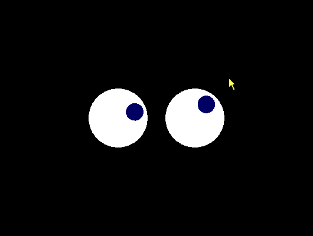

# SimpleGames

Simple Games

# screenshots

### Asteroids


### Bird


### Blackjack


### Blocks


### Snake


### Flowers


### Sokoban


### Fifteen


### Repeat


### Life


### Eyes



### 2048


# Use zerobrane to debug love2d

- Make [LÖVE executable](https://love2d.org/) available in PATH or put it into one of the default folders: `C:\Program Files\love` or `D:\Program Files\love` on Windows or `/Applications` on Mac OS X.
- Switch to LÖVE interpreter by going to `Project | Lua Interpreter | LÖVE`.
- Add `if arg[#arg] == "-debug" then require("mobdebug").start() end` to `love.load()` function

```lua
function love.load()
    -- For ZeroBrane debugger
    if arg[#arg] == "-debug" then require("mobdebug").start() end

    -- etc.
end
```

# links

- https://studio.zerobrane.com/
- https://github.com/pkulchenko/ZeroBraneStudio
- https://github.com/samyeyo/LuaRT-Studio
- https://simplegametutorials.github.io/
